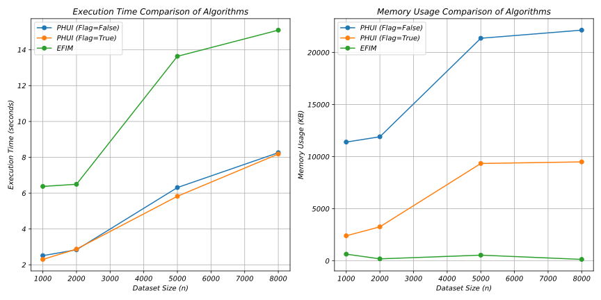
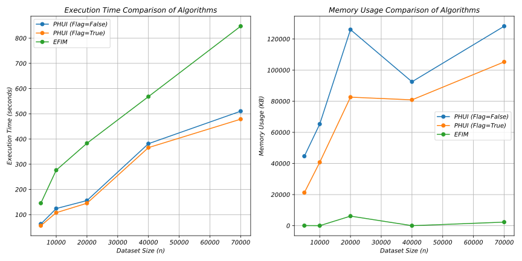
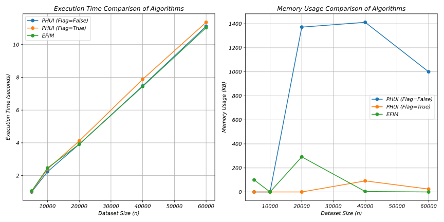
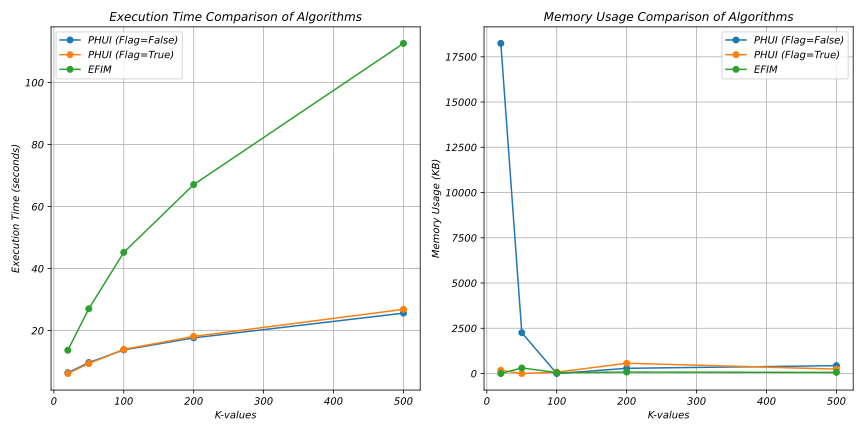
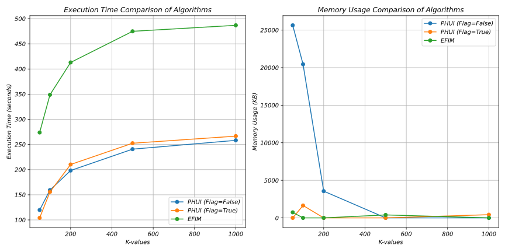
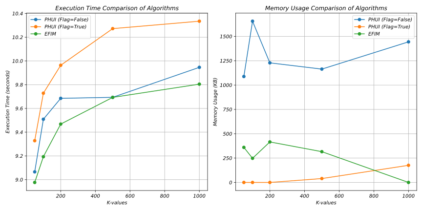

# Mining Top-K Periodic High-Utility Itemsets from Uncertain Database

> Design and analysis of algorithms for mining Top-K periodic high-utility itemsets from uncertain databases

---

## Author / Tác Giả

**Pham Nguyen Khoi Nguyen**  
Faculty of Information Technology  
Ton Duc Thang University  
Email: 52000695@student.tdtu.edu.vn | pnknguyen0211@gmail.com

**Supervisor:** Dr. Nguyen Chi Thien

---

## Language Versions / Phiên Bản Ngôn Ngữ

<div>

### Choose your preferred language / Chọn ngôn ngữ

[](#english-version)
[](#phiên-bản-tiếng-việt)

</div>

---

<a id="english-version"></a>

# 🇬🇧 English Version

---

## Project Overview

This project researches and implements advanced algorithms for mining **Top-K Periodic High-Utility Itemsets (PHUIs)** from uncertain databases. This is an important problem in data mining with numerous real-world applications including:

- Periodic sales trend analysis
- Periodic network traffic monitoring
- Medical diagnosis based on periodic patterns
- Forecasting and analyzing uncertain data

### Key Features

```
┌─────────────────────────────────────────────────────────────┐
│  PHUI Mining Framework                                      │
│                                                             │
│  ┌──────────────┐   ┌──────────────┐   ┌──────────────┐     │
│  │   Periodic   │ + │  High-Utility│ + │  Uncertain   │     │
│  │   Patterns   │   │   Itemsets   │   │   Database   │     │
│  └──────────────┘   └──────────────┘   └──────────────┘     │
│         |                   |                   |           │
│  └─────────────────────────────────────────────────────┘    │
│                     Advanced Algorithms                     │
│            PHMN  •  PHMN+  •  TKN                           │
└─────────────────────────────────────────────────────────────┘
```

---

## Proposed Algorithms

### 1. PHMN (Periodic High-Utility Mining - Negative)

**Characteristics:**

- Uses PNU-List structure to store utility information
- Applies pruning strategies: TWU, RU, ExpSup, Periodic
- Handles both negative and positive utilities
- Suitable for medium-density datasets

**Advantages:**

- Simple implementation, easy to understand
- Good performance across various datasets

**Disadvantages:**

- Generates more redundant candidate itemsets
- Higher memory consumption than PHMN+

---

### 2. PHMN+ (Enhanced PHMN)

**Characteristics:**

- Enhanced version of PHMN with **Dynamic Upper Bound (DU) Pruning** strategy
- Uses **MList** structure for optimized storage
- Eliminates non-promising itemsets before initialization

**Advantages:**

- **Fastest** among the three algorithms
- **Most memory-efficient** thanks to DU Pruning
- Highly effective on dense datasets

**Disadvantages:**

- More complex implementation
- Higher overhead when k is large due to frequent DU Pruning checks

```
┌──────────────────────────────────────────────────────────┐
│  PHMN+ Architecture                                      │
│                                                          │
│  Input → [PLIU Strategy] → [Filter Items]                │
│              |                                           │
│         [Build PNU-List & MList]                         │
│              |                                           │
│         [DU Pruning Strategy] ←──┐                       │
│              |                   │                       │
│         [Search & Expand]────────┘                       │
│              |                                           │
│         Top-K PHUIs                                      │
└──────────────────────────────────────────────────────────┘
```

---

### 3. TKN (Top-K Negative Utility)

**Characteristics:**

- Uses **Local Utility** and **Subtree Utility** for pruning
- Divides items into **Primary** and **Secondary** sets
- Does not use complex data structures like PNU-List

**Advantages:**

- **Very memory-efficient** (no complex storage structures)
- **Effective on sparse datasets**
- Generates fewest candidate itemsets

**Disadvantages:**

- **Slowest execution time** on dense datasets
- High computational cost due to lack of supporting structures

---

## Performance Comparison

### Overall Comparison Table

| Criteria             | PHMN            | PHMN+               | TKN                   |
| -------------------- | --------------- | ------------------- | --------------------- |
| **Speed**            | Medium          | Fastest             | Slowest               |
| **Memory**           | Medium          | Lowest              | Very Low              |
| **Dense datasets**   | Good            | Very Good           | Poor                  |
| **Sparse datasets**  | Medium          | Medium              | Best                  |
| **Complexity**       | O(2^n)          | O(2^n)              | O(2^n)                |
| **Data structure**   | PNU-List        | PNU-List + MList    | None                  |
| **Pruning strategy** | TWU, RU, ExpSup | TWU, RU, DU, ExpSup | Local/Subtree Utility |

---

## Experimental Results

### Dataset Information

| Dataset      | Transactions | Items | Avg Items/Trans | Density |
| ------------ | ------------ | ----- | --------------- | ------- |
| **Mushroom** | 8,416        | 119   | 23.00           | 19.33%  |
| **Connect**  | 67,557       | 129   | 43.00           | 33.33%  |
| **BMS**      | 59,602       | 497   | 2.51            | 0.51%   |

---

### 1. Impact of Dataset Size (n)

#### Dataset: Mushroom (Dense - 19.33%)

<div align="center">
  
</div>

**Analysis:**

- PHMN+ excels with shortest execution time
- PHMN achieves medium results, significantly better than TKN
- Memory: PHMN+ < PHMN < TKN (though TKN uses least)

---

#### Dataset: Connect (Very Dense - 33.33%)

<div align="center">
  
</div>

**Analysis:**

- Gap between PHMN+ and the other two algorithms becomes more pronounced
- TKN faces severe challenges with high-density datasets
- PHMN+ achieves best memory efficiency thanks to DU Pruning

---

#### Dataset: BMS (Very Sparse - 0.51%)

<div align="center">
  
</div>

**Analysis:**

- **Surprising:** TKN becomes the fastest algorithm!
- Sparse dataset reduces search space
- TKN leverages its advantage of no data structure overhead
- All three algorithms achieve similar performance

---

### 2. Impact of Top-K

#### Dataset: Mushroom

<div align="center">
  
</div>

**Analysis:**

- As k increases, execution time rises sharply due to expanded search space
- **Important:** PHMN sometimes outperforms PHMN+ when k is large
  - Reason: PHMN+ must check DU Pruning for too many itemsets
  - PHMN has no such overhead, making it faster
- Memory increases linearly with k

---

#### Dataset: Connect

<div align="center">
  
</div>

**Analysis:**

- Similar trend to Mushroom but more pronounced
- TKN has highest execution time across all k values
- PHMN+ maintains memory advantage

---

#### Dataset: BMS

<div align="center">
  
</div>

**Analysis:**

- TKN maintains leading position in speed
- Narrowed search space reduces PHMN+ advantage
- Memory usage is low and stable

---

## Detailed Analysis

### When to Use Which Algorithm?

```
┌─────────────────────────────────────────────────────────────┐
│  Decision Tree: Choosing the Right Algorithm                │
│                                                             │
│                    Your Dataset?                            │
│                           |                                 │
│           ┌───────────────┼───────────────┐                 │
│           |               |               |                 │
│        Dense          Medium           Sparse               │
│       (>15%)          (5-15%)          (<5%)                │
│           |               |               |                 │
│           |               |               |                 │
│      PHMN+ (Best)     PHMN+ (Good)    TKN (Best)            │
│      PHMN  (Good)     PHMN  (Good)    PHMN+ (Good)          │
│      TKN   (Poor)     TKN   (Poor)    PHMN  (Good)          │
│                                                             │
│  Notes:                                                     │
│  • If k is very large (>500) and dataset is dense           │
│    → consider PHMN                                          │
│  • If memory is limited → prioritize TKN                    │
│  • If maximum speed is needed → prioritize PHMN+            │
└─────────────────────────────────────────────────────────────┘
```

---

### Algorithm Complexity

**All three algorithms have:**

- **Time complexity:** O(2^n) - in worst case
- **Reason:** Search space is combinatorial over itemsets

**However, pruning strategies help:**

```
Theoretical: O(2^n)
                |
        [Pruning Strategies]
                |
Practical: Much better!

PHMN:  2^n - pruned by TWU, RU, ExpSup
PHMN+: 2^n - pruned by TWU, RU, DU, ExpSup  ← Most pruning
TKN:   2^n - pruned by Local/Subtree Utility
```

---

## Installation and Usage

### System Requirements

- Python 3.8+
- Jupyter Notebook
- NumPy, Pandas

### Running Experiments

```bash
# Clone repository
git clone <repository-url>
cd mining-periodic-high-utility-itemset-in-uncertain-database

# Open Jupyter Notebook
jupyter notebook algorithm_implementation.ipynb
```

### Input Parameters

```python
parameters = {
    'k': 10,                 # Number of PHUIs to find
    'minProb': 0.1,          # Minimum probability threshold
    'minPer': 1,             # Minimum period
    'maxPer': 5,             # Maximum period
    'minAvg': 1,             # Minimum average period
    'maxAvg': 3              # Maximum average period
}
```

---

## Conclusion

### Main Contributions

1. **Negative utility handling:** All three algorithms support both negative and positive utilities
2. **Periodicity integration:** Detects patterns appearing in periodic cycles
3. **Uncertain data:** Handles probabilities in each transaction
4. **Top-K mining:** Automatically adjusts minUtil threshold

### Main Results

| Algorithm | Strengths                         | Weaknesses                    | Recommendation                |
| --------- | --------------------------------- | ----------------------------- | ----------------------------- |
| **PHMN**  | Balanced, easy implementation     | Higher memory than PHMN+      | Medium datasets               |
| **PHMN+** | Fastest and most efficient        | Complex, poor when k is large | Dense datasets (Recommended)  |
| **TKN**   | Very low memory, good with sparse | Slow on dense data            | Sparse datasets (Recommended) |

---

## References

### Papers

1. **EFIM**: Zida et al. - "EFIM: A Fast and Memory Efficient Algorithm for High-Utility Itemset Mining"
2. **HUI-Miner**: Liu & Qu - "Mining High Utility Itemsets Without Candidate Generation"
3. **TKN**: Ashraf et al. - "TKN: An Efficient Approach for Discovering Top-k High Utility Itemsets"
4. **FHM**: Fournier-Viger et al. - "FHM: Faster High-Utility Itemset Mining Using EUCP"

### Details

See PDF file: `Mining periodic high-utility itemsets in uncertain database.pdf`

---

## License

This project is developed for academic research purposes.

---

<div align="center">

**If this project is helpful, please give it a star! ⭐**

Made with dedication for advancing Data Mining research

[🔝 Back to Top](#mining-top-k-periodic-high-utility-itemsets-from-uncertain-database) | [🇻🇳 Xem Phiên Bản Tiếng Việt](#phiên-bản-tiếng-việt)

</div>

---

---

<a id="phiên-bản-tiếng-việt"></a>

# 🇻🇳 Phiên Bản Tiếng Việt / Vietnamese Version

---

# Khai Phá Top-K Tập Mục Định Kỳ Có Độ Hữu Ích Cao Từ Cơ Sở Dữ Liệu Không Chắc Chắn

> Thiết kế và phân tích các thuật toán tìm kiếm Top-K tập mục định kỳ có độ hữu ích cao từ cơ sở dữ liệu không chắc chắn

---

## Tổng Quan Dự Án

Dự án này nghiên cứu và triển khai các thuật toán tiên tiến để khai phá **Top-K Periodic High-Utility Itemsets (PHUIs)** từ cơ sở dữ liệu không chắc chắn. Đây là bài toán quan trọng trong lĩnh vực khai phá dữ liệu, với nhiều ứng dụng thực tế như:

- Phân tích xu hướng bán hàng theo chu kỳ
- Giám sát lưu lượng mạng định kỳ
- Chẩn đoán y khoa dựa trên mẫu định kỳ
- Dự báo và phân tích dữ liệu không chắc chắn

### Đặc Điểm Nổi Bật

```
┌─────────────────────────────────────────────────────────────┐
│  PHUI Mining Framework                                      │
│                                                             │
│  ┌──────────────┐   ┌──────────────┐   ┌──────────────┐     │
│  │   Periodic   │ + │  High-Utility│ + │  Uncertain   │     │
│  │   Patterns   │   │   Itemsets   │   │   Database   │     │
│  └──────────────┘   └──────────────┘   └──────────────┘     │
│         |                   |                   |           │
│  └─────────────────────────────────────────────────────┘    │
│                     Advanced Algorithms                     │
│            PHMN  •  PHMN+  •  TKN                           │
└─────────────────────────────────────────────────────────────┘
```

---

## Các Thuật Toán Đề Xuất

### 1. PHMN (Periodic High-Utility Mining - Negative)

**Đặc điểm:**

- Sử dụng cấu trúc PNU-List để lưu trữ thông tin tiện ích
- Áp dụng các chiến lược cắt tỉa: TWU, RU, ExpSup, Periodic
- Xử lý được tiện ích âm và dương
- Phù hợp với dữ liệu có độ dày đặc trung bình

**Ưu điểm:**

- Cài đặt đơn giản, dễ hiểu
- Hiệu suất tốt trên nhiều loại dataset

**Nhược điểm:**

- Sinh ra nhiều tập mục ứng viên dư thừa
- Tiêu tốn bộ nhớ cao hơn PHMN+

---

### 2. PHMN+ (Enhanced PHMN)

**Đặc điểm:**

- Cải tiến từ PHMN với chiến lược **Dynamic Upper Bound (DU) Pruning**
- Sử dụng cấu trúc **MList** để tối ưu hóa việc lưu trữ
- Loại bỏ tập mục không tiềm năng trước khi khởi tạo

**Ưu điểm:**

- **Nhanh nhất** trong 3 thuật toán
- **Tiết kiệm bộ nhớ** nhất nhờ DU Pruning
- Hiệu quả cao trên dataset dày đặc

**Nhược điểm:**

- Phức tạp hơn trong cài đặt
- Overhead cao khi k lớn do phải kiểm tra DU Pruning nhiều

```
┌──────────────────────────────────────────────────────────┐
│  PHMN+ Architecture                                      │
│                                                          │
│  Input → [PLIU Strategy] → [Filter Items]                │
│              |                                           │
│         [Build PNU-List & MList]                         │
│              |                                           │
│         [DU Pruning Strategy] ←──-┐                      │
│              |                    │                      │
│         [Search & Expand]─────────┘                      │
│              |                                           │
│         Top-K PHUIs                                      │
└──────────────────────────────────────────────────────────┘
```

---

### 3. TKN (Top-K Negative Utility)

**Đặc điểm:**

- Sử dụng **Local Utility** và **Subtree Utility** để cắt tỉa
- Phân chia items thành **Primary** và **Secondary** sets
- Không sử dụng cấu trúc dữ liệu phức tạp như PNU-List

**Ưu điểm:**

- **Rất tiết kiệm bộ nhớ** (không dùng cấu trúc lưu trữ phức tạp)
- **Hiệu quả tốt trên dataset thưa** (sparse data)
- Sinh ít tập mục ứng viên nhất

**Nhược điểm:**

- Thời gian chạy **chậm nhất** trên dataset dày đặc
- Chi phí tính toán cao do không có cấu trúc hỗ trợ

---

## So Sánh Hiệu Suất

### Bảng So Sánh Tổng Quan

| Tiêu Chí               | PHMN            | PHMN+               | TKN                   |
| ---------------------- | --------------- | ------------------- | --------------------- |
| **Tốc độ**             | Trung bình      | Nhanh nhất          | Chậm nhất             |
| **Bộ nhớ**             | Trung bình      | Thấp nhất           | Rất thấp              |
| **Dataset dày đặc**    | Tốt             | Rất tốt             | Kém                   |
| **Dataset thưa**       | Trung bình      | Trung bình          | Tốt nhất              |
| **Độ phức tạp**        | O(2^n)          | O(2^n)              | O(2^n)                |
| **Cấu trúc dữ liệu**   | PNU-List        | PNU-List + MList    | Không                 |
| **Chiến lược cắt tỉa** | TWU, RU, ExpSup | TWU, RU, DU, ExpSup | Local/Subtree Utility |

---

## Kết Quả Thực Nghiệm

### Dataset Thông Tin

| Dataset      | Transactions | Items | Avg Items/Trans | Density |
| ------------ | ------------ | ----- | --------------- | ------- |
| **Mushroom** | 8,416        | 119   | 23.00           | 19.33%  |
| **Connect**  | 67,557       | 129   | 43.00           | 33.33%  |
| **BMS**      | 59,602       | 497   | 2.51            | 0.51%   |

---

### 1. Ảnh Hưởng của Kích Thước Dataset (n)

#### Dataset: Mushroom (Dày đặc - 19.33%)

<div align="center">
  
</div>

**Phân tích:**

- PHMN+ vượt trội với thời gian thực thi ngắn nhất
- PHMN cho kết quả trung bình, tốt hơn TKN đáng kể
- Bộ nhớ: PHMN+ < PHMN < TKN (tuy TKN dùng ít nhất)

---

#### Dataset: Connect (Rất dày đặc - 33.33%)

<div align="center">
  
</div>

**Phân tích:**

- Khoảng cách giữa PHMN+ và hai thuật toán còn lại càng rõ rệt
- TKN gặp khó khăn nghiêm trọng với dataset dày đặc cao
- PHMN+ tiết kiệm bộ nhớ tốt nhất nhờ DU Pruning

---

#### Dataset: BMS (Rất thưa - 0.51%)

<div align="center">
  
</div>

**Phân tích:**

- **Bất ngờ:** TKN trở thành thuật toán nhanh nhất!
- Dataset thưa làm giảm không gian tìm kiếm
- TKN tận dụng được lợi thế không có overhead từ cấu trúc dữ liệu
- Cả 3 thuật toán đều có hiệu suất gần nhau

---

### 2. Ảnh Hưởng của Top-K

#### Dataset: Mushroom

<div align="center">
  
</div>

**Phân tích:**

- Khi k tăng, thời gian thực thi tăng mạnh do không gian tìm kiếm mở rộng
- **Quan trọng:** PHMN đôi khi vượt PHMN+ khi k lớn
  - Lý do: PHMN+ phải kiểm tra DU Pruning cho quá nhiều tập mục
  - PHMN không có overhead này nên nhanh hơn
- Bộ nhớ tăng tuyến tính với k

---

#### Dataset: Connect

<div align="center">
  
</div>

**Phân tích:**

- Xu hướng tương tự Mushroom nhưng rõ rệt hơn
- TKN có thời gian thực thi cao nhất ở mọi giá trị k
- PHMN+ vẫn duy trì lợi thế về bộ nhớ

---

#### Dataset: BMS

<div align="center">
  
</div>

**Phân tích:**

- TKN duy trì vị trí dẫn đầu về tốc độ
- Không gian tìm kiếm thu hẹp làm giảm lợi thế của PHMN+
- Bộ nhớ sử dụng thấp và ổn định

---

## Phân Tích Chi Tiết

### Khi Nào Dùng Thuật Toán Nào?

```
┌─────────────────────────────────────────────────────────────┐
│  Decision Tree: Chọn Thuật Toán Phù Hợp                     │
│                                                             │
│                    Dataset của bạn?                         │
│                           |                                 │
│           ┌───────────────┼───────────────┐                 │
│           |               |               |                 │
│       Dày đặc         Trung bình       Thưa                 │
│      (>15%)          (5-15%)          (<5%)                 │
│           |               |               |                 │
│           |               |               |                 │
│      PHMN+ (Tốt nhất) PHMN+ (Tốt)    TKN (Tốt nhất)         │
│      PHMN  (Tốt)      PHMN  (Tốt)    PHMN+ (Tốt)            │
│      TKN   (Kém)      TKN   (Kém)    PHMN  (Tốt)            │
│                                                             │
│  Lưu ý:                                                     │
│  • Nếu k rất lớn (>500) và dataset dày → xem xét PHMN       │
│  • Nếu bộ nhớ hạn chế → ưu tiên TKN                         │
│  • Nếu cần tốc độ tối đa → ưu tiên PHMN+                    │
└─────────────────────────────────────────────────────────────┘
```

---

### Độ Phức Tạp Thuật Toán

**Cả 3 thuật toán đều có:**

- **Độ phức tạp thời gian:** O(2^n) - trong trường hợp xấu nhất
- **Lý do:** Không gian tìm kiếm là tổ hợp các tập mục

**Tuy nhiên, các chiến lược cắt tỉa giúp:**

```
Theoretical: O(2^n)
                |
        [Pruning Strategies]
                |
Practical: Much better!

PHMN:  2^n - pruned by TWU, RU, ExpSup
PHMN+: 2^n - pruned by TWU, RU, DU, ExpSup  ← Nhiều nhất
TKN:   2^n - pruned by Local/Subtree Utility
```

---

## Cài Đặt và Sử Dụng

### Yêu Cầu Hệ Thống

- Python 3.8+
- Jupyter Notebook
- NumPy, Pandas

### Chạy Thử Nghiệm

```bash
# Clone repository
git clone <repository-url>
cd mining-periodic-high-utility-itemset-in-uncertain-database

# Mở Jupyter Notebook
jupyter notebook algorithm_implementation.ipynb
```

### Tham Số Đầu Vào

```python
parameters = {
    'k': 10,                 # Số lượng PHUIs cần tìm
    'minProb': 0.1,          # Ngưỡng xác suất tối thiểu
    'minPer': 1,             # Chu kỳ tối thiểu
    'maxPer': 5,             # Chu kỳ tối đa
    'minAvg': 1,             # Trung bình chu kỳ tối thiểu
    'maxAvg': 3              # Trung bình chu kỳ tối đa
}
```

---

## Kết Luận

### Đóng Góp Chính

1. **Xử lý tiện ích âm:** Cả 3 thuật toán đều hỗ trợ tiện ích âm và dương
2. **Tích hợp tính định kỳ:** Phát hiện mẫu xuất hiện theo chu kỳ
3. **Dữ liệu không chắc chắn:** Xử lý xác suất trong từng giao dịch
4. **Top-K mining:** Tự động điều chỉnh ngưỡng minUtil

### Kết Quả Chính

| Thuật Toán | Điểm Mạnh                     | Điểm Yếu             | Khuyến Nghị                   |
| ---------- | ----------------------------- | -------------------- | ----------------------------- |
| **PHMN**   | Cân bằng, dễ cài đặt          | Bộ nhớ cao hơn PHMN+ | Dataset trung bình            |
| **PHMN+**  | Nhanh và tiết kiệm nhất       | Phức tạp, k lớn kém  | Dataset dày đặc (Khuyên dùng) |
| **TKN**    | Rất ít bộ nhớ, tốt với sparse | Chậm trên dense data | Dataset thưa (Khuyên dùng)    |

---

## Tài Liệu Tham Khảo

### Papers

1. **EFIM**: Zida et al. - "EFIM: A Fast and Memory Efficient Algorithm for High-Utility Itemset Mining"
2. **HUI-Miner**: Liu & Qu - "Mining High Utility Itemsets Without Candidate Generation"
3. **TKN**: Ashraf et al. - "TKN: An Efficient Approach for Discovering Top-k High Utility Itemsets"
4. **FHM**: Fournier-Viger et al. - "FHM: Faster High-Utility Itemset Mining Using EUCP"

### Chi Tiết

Xem file PDF: `Mining periodic high-utility itemsets in uncertain database.pdf`

---

## License

This project is developed for academic research purposes.

---

<div align="center">

**Nếu dự án này hữu ích, hãy cho một star! ⭐**

Made with dedication for advancing Data Mining research

[🔝 Về Đầu Trang](#mining-top-k-periodic-high-utility-itemsets-from-uncertain-database) | [🇬🇧 View English Version](#english-version)

</div>
